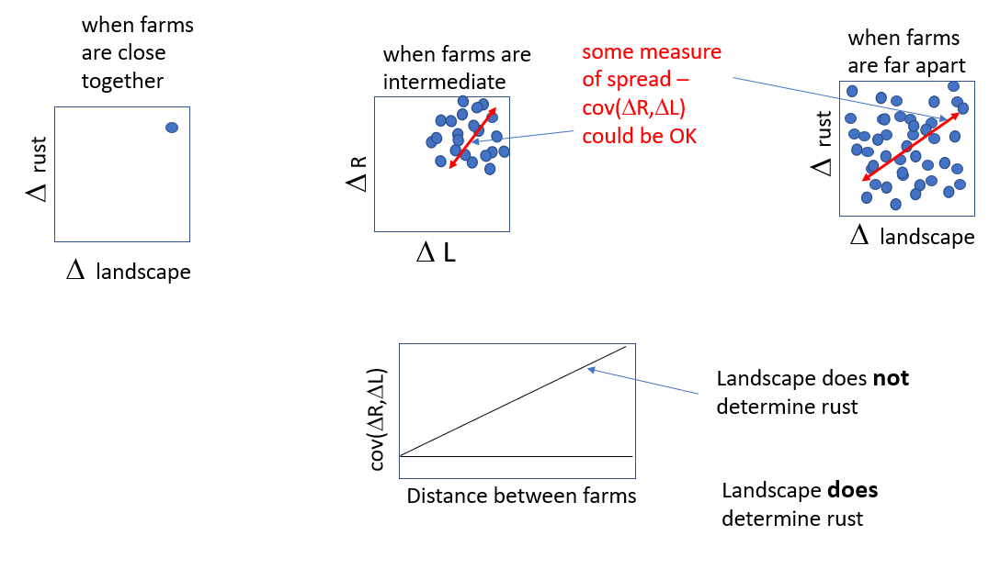

```{r setup, include=FALSE}
knitr::opts_chunk$set(echo = FALSE, message=F, warning = F)

library(tidyverse)
library(sf)
library(ggspatial)
library(ape)
library(egg)

farms <- read.csv("./Data/PR_farms27.csv") %>%
  st_as_sf(coords = c(4, 3), crs = st_crs(4326)) %>% st_transform(crs = st_crs(6566))

land <- read.csv("./Data/2021_10_26_PR_farm_mean_data_with_landscape_classification_all_scales.csv") %>% select(site_name, for_100:dev_1500) %>% distinct()

biotic <- read.csv("./Data/2021_10_26_PR_farm_mean_data_with_landscape_classification_all_scales.csv") %>% select(site_name:farm_mite_den)


```

## Pearson vs. Spearman correlation revisited

I revisited the correlation tests over different landscape scales. Mainly I wanted to see if transforming the data before performing the Pearson correlation would help clarify some patterns. Avelino also transformed the data by taking the Arcsine square-root of the proportion of infected leaves.

Here, I am taking the natural log of the maximum infected leaf counts, since we can't calculate a proportion like Avelino. In cases where there were 0 leaves, I added 0.05 first before taking the log. This is because the lowest non-zero farm maximum was 0.1 (averaged over all plants), so I'm taking half of that as "zero." I am also transforming the landscape variable using Arcsine square-root, because this transformation is appropriate for proportions.

```{r log_transformation, fig.width=7, fig.height=3}

royamax <- biotic %>% group_by(site_name) %>%
  summarize(max_roya = max(farm_roya)) %>% ungroup() %>% 
  mutate(log_roya = case_when(
    max_roya == 0 ~ 0.05,
    max_roya > 0 ~ max_roya
    ) %>% log()) %>%
  left_join(land) %>%
  pivot_longer(cols = for_100:dev_1500, 
               names_to = c("lc", "radius"),
               names_pattern = "(.*)_(.*)", 
               values_to = "area") %>%
  mutate(radius = as.numeric(radius)) %>%
  mutate(area_asinsqrt = asin(sqrt(area))) %>% 
  filter(site_name != "YAUC5*")
  

fl.prcor.psn <- royamax %>% group_by(lc, radius) %>% 
  dplyr::summarize(
    pcor = cor(log_roya, asin(sqrt(area)), use="complete.obs"),
    pval = cor.test(log_roya, asin(sqrt(area)), use="complete.obs")$p.value) %>%
  ungroup() %>%
  mutate(radius = as.numeric(radius)) %>%
  mutate(signif = case_when(
    pval < 0.001 ~ "***",
    pval < 0.01 ~ "**",
    pval < 0.05 ~ "*",
    pval >= 0.05 ~ "NS"
  ))

# test <- royamax %>% filter(lc == "for" & radius == 200)
# test2 <- cor.test(test$max_roya, test$area, method = "spearman")

fl.prcor.spm <- royamax %>% group_by(lc, radius) %>% 
  dplyr::summarize(
    pcor = cor(max_roya, area, use="complete.obs", method = "spearman"),
    pval = cor.test(max_roya, area, use="complete.obs", method = "spearman")$p.value) %>%
  ungroup() %>%
  mutate(radius = as.numeric(radius)) %>%
  mutate(signif = case_when(
    pval < 0.001 ~ "***",
    pval < 0.01 ~ "**",
    pval < 0.05 ~ "*",
    pval >= 0.05 ~ "NS"
  ))

corpsn <- ggplot(fl.prcor.psn, aes(radius, pcor, group = lc)) +
  geom_line() +
  geom_point(aes(shape = lc, color = signif), size = 3) + 
  theme_article() + 
  scale_color_manual(values = c("dark green", "grey")) +
  scale_shape_manual(values = 15:18) + 
  theme(legend.position = "none") +
  xlab("Spatial scale (m)") +
  ylab("Pearson correlation coefficient")

corspm <- ggplot(fl.prcor.spm, aes(radius, pcor, group = lc)) +
  geom_line() +
  geom_point(aes(shape = lc, color = signif), size = 3) + 
  theme_article() + 
  scale_color_manual(values = c("dark green", "grey")) +  
  scale_shape_manual(values = 15:18) + 
  xlab("Spatial scale (m)") +
  ylab("Spearman correlation coefficient")

ggarrange(corpsn, corspm, ncol = 2, labels = c("a", "b"))


```

**Figure 1** Comparision between Pearson's correlation coefficients of transformed variables (log(roya)) and arcsin(sqrt(% area)) **(a)** and Spearman's correlation coefficients of original variables (# roya leaves and % area) **(b)**, for a range of spatial scales.

The results for the Pearson correlation of the transformed variables match better with the Spearman results than before when we did it on the untransformed data. I guess this makes sense since the data are now closer to normal. For some reason, I got different significant p-values for the Spearman's correlation tests than Zach, but the shape is similar. I'm not sure if it's because we're using slightly different cutoffs, or datasets.

From what I've read, the Pearson correlation coefficient is appropriate for data you expect to be linearly related, while the Spearman is appropriate for data that you expect to be monotonically related. Spearman is less sensitive to outliers, though. In Figures 2 and 3, I plot the data that is being used to calculate the correlation - the transformed variables for the new Pearson values and the ranks for Spearman. Maybe there's some reason for concern about the formerly 0 roya values and the very low roya farm. They seem to be outliers in the Pearson plots.

```{r forest_panels, fig.width=7, fig.height=5}

forest_panel_data <- royamax %>% filter(lc == "for") %>%
  group_by(radius) %>%
  mutate(area_rank = rank(area)) %>%
  mutate(roya_rank = rank(max_roya)) %>% ungroup()

for.psn.panel <- ggplot(forest_panel_data, 
       aes(asin(sqrt(area)), log_roya)) + 
  geom_point() + 
  geom_smooth(method = lm, se = F) +
  facet_wrap(~radius) +
  geom_text(data = fl.prcor.psn %>% filter(lc == "for"), 
           mapping = aes(x = 0.3, y = -2.3, label = round(pval, 2)), color = "red", size = 3) +
  theme_article() + xlab("asin(sqrt(% area))")

for.spm.panel <- ggplot(forest_panel_data, 
       aes(area_rank, roya_rank)) + 
  geom_point() + 
  geom_smooth(method = lm, se = F) +
  facet_wrap(~radius) +
  geom_text(data = fl.prcor.spm %>% filter(lc == "for"), 
           mapping = aes(x = 5, y = 5, label = round(pval, 2)), color = "red", size = 3) +
  theme_article() + xlab("rank area") + ylab("rank roya")

ggarrange(for.psn.panel, for.spm.panel, ncol = 2, labels = c("a", "b"))

```

**Figure 2** Correlation between maximum roya and % forest within a certain radius. Each panel title indicates this radius. Pearson correlation coefficient **(a)** is shown between log transformed roya and arcsin square-root transformed % area. Spearman correlation coefficient **(b)** is shown between the untransformed roya and % area ranks

```{r pasture_panels, fig.width=7, fig.height=5}

pasture_panel_data <- royamax %>% filter(lc == "pas") %>%
  group_by(radius) %>%
  mutate(area_rank = rank(area)) %>%
  mutate(roya_rank = rank(max_roya)) %>% ungroup()

pas.psn.panel <- ggplot(pasture_panel_data, 
       aes(asin(sqrt(area)), log_roya)) + 
  geom_point() + 
  geom_smooth(method = lm, se = F) +
  facet_wrap(~radius) +
  geom_text(data = fl.prcor.psn %>% filter(lc == "pas"), 
           mapping = aes(x = 0.6, y = -2.3, label = round(pval, 2)), color = "red", size = 3) +
  theme_article() + xlab("asin(sqrt(% area))")

pas.spm.panel <- ggplot(pasture_panel_data, 
       aes(area_rank, roya_rank)) + 
  geom_point() + 
  geom_smooth(method = lm, se = F) +
  facet_wrap(~radius) +
  geom_text(data = fl.prcor.spm %>% filter(lc == "pas"), 
           mapping = aes(x = 5, y = 5, label = round(pval, 2)), color = "red", size = 3) +
  theme_article() + xlab("rank area") + ylab("rank roya")

ggarrange(pas.psn.panel, pas.spm.panel, ncol = 2, labels = c("a", "b"))

```

**Figure 3** Correlation between maximum roya and % pasture within a certain radius. Each panel title indicates this radius. Pearson correlation coefficient **(a)** is shown between log transformed roya and arcsin square-root transformed % area. Spearman correlation coefficient **(b)** is shown between the untransformed roya and % area ranks.

## Landscape + roya variables in variograms against distance (John's package idea)

Here is John's idea:


I think a way to get to this is to plot the pairwise geographic distances between farms against the product of their pairwise differences between land cover and roya, as $\gamma =(Z_{land_i} - Z_{land_j})(Z_{rust_i} - Z_{rust_j})$, where $Z_{land}$ and $Z_{rust}$ are the landscape and rust Z-score values for a given pair of farms $i$ and $j$, over all $i$ and for $i > j$ (the lower triangle of a pairwise matrix). This is similar to the semivariogram. Also similar to the semivariogram, you could take the mean over a certain band of separation distances to get something like the covariance for farms separated for that band of distance.

I see a connection between the Pearson correlation and John's idea for looking at landscape effect. One way to define the Pearson correlation is as the mean of the product of Z scores for the two correlated variables $r_{xy} = \frac{\sum{Z_xZ_y}}{n}$. So by taking the mean of what I call $\gamma$ (gamma) above, I think it is a kind of Pearson correlation for farms within groups of separation distances. In the plots below, the black dots are the pairwise values of gamma and the blue dots are the means of the 5000m bins shown by black vertical lines.

```{r semicovariogram_forest, message = F, fig.width=7, fig.height=4}

# function for calculating difference matrix
diffmat = function(x){
  D = matrix(as.numeric(NA), NROW(x), NROW(x))
  for (i in 1:NROW(x)){
    d = x[[i]] - x[-i]
    D[i,-i] = d
  }
  if (!all(is.na(diag(D)))){
    stop("Not all diagonal elements zero")
  }
  diag(D) = 0
  if (!is.null(names(x))) colnames(D) = rownames(D) = names(x)
  return(D)
}

for100 <- royamax %>% filter(lc == "for" & radius == 100) %>%
  mutate(roya_Z = scale(log_roya)) %>%
  mutate(area_z = scale(area_asinsqrt))

for100_roya_Z_delt <- diffmat(for100$roya_Z)
for100_Z_delt <- diffmat(for100$area_asinsqrt)

for100_eucdist <- st_distance(
  farms %>% right_join(for100, by = c("PESTS_sitename" = "site_name")),
  farms %>% right_join(for100, by = c("PESTS_sitename" = "site_name")))
units(for100_eucdist) <- NULL


roya_Z_lowertri <- for100_roya_Z_delt[lower.tri(for100_roya_Z_delt)]
for100_lowertri <- for100_Z_delt[lower.tri(for100_Z_delt)]
for100_gamma <- roya_Z_lowertri * for100_lowertri
eucdist_lowertri <- for100_eucdist[lower.tri(for100_eucdist)]

forestcov <- data.frame(distance = eucdist_lowertri, gamma = for100_gamma) %>%
  mutate(distbin = cut(distance, breaks = seq(0, 65000, by = 5000),
                       labels = seq(2500,62500, by = 5000)))

for_gammasample <- forestcov %>% group_by(distbin) %>%
  summarise(n = n(), mean = mean(gamma), std = sd(gamma)) %>% 
  ungroup() %>%
  mutate(se = std/sqrt(n)) %>%
  mutate(distance = as.numeric(as.character(distbin)))

ggplot(forestcov, aes(distance, gamma)) + geom_point() + 
  geom_vline(data = for_gammasample, 
             mapping = aes(xintercept = distance - 2500), alpha = 0.2) +
  geom_hline(yintercept = 0, alpha = 0.2) +
  geom_pointrange(data = for_gammasample, 
                  mapping = aes(x = distance, y = mean, ymin = mean-se, ymax = mean+se),
                  color ="blue", size = 1, alpha = 0.5) +
  theme_article() + xlab("distance (m)")

```

**Figure 4** Forest semivariograms. Black points are individual farm pairs with Y axis (gamma) = $(Z_{land_i} - Z_{land_j})(Z_{rust_i} - Z_{rust_j})$, or the standardized difference in rust times the standardized difference in landscape. Blue points are the averaged values over the values within 5000m bins, with lines representing standard error

```{r semicovariogram_pasture, message = F, fig.width=7, fig.height=4}

pas700 <- royamax %>% filter(lc == "pas" & radius == 700) %>%
  mutate(roya_Z = scale(log_roya)) %>%
  mutate(area_z = scale(area_asinsqrt))

pas700_roya_Z_delt <- diffmat(pas700$roya_Z)
pas700_Z_delt <- diffmat(pas700$area_asinsqrt)

pas700_eucdist <- st_distance(
  farms %>% right_join(pas700, by = c("PESTS_sitename" = "site_name")),
  farms %>% right_join(pas700, by = c("PESTS_sitename" = "site_name")))
units(pas700_eucdist) <- NULL


pas_roya_Z_lowertri <- pas700_roya_Z_delt[lower.tri(pas700_roya_Z_delt)]
pas700_lowertri <- pas700_Z_delt[lower.tri(pas700_Z_delt)]
pas700_gamma <- pas_roya_Z_lowertri * pas700_lowertri
pas_eucdist_lowertri <- pas700_eucdist[lower.tri(pas700_eucdist)]

pasturecov <- data.frame(farm = pas700$site_name, 
                         distance = pas_eucdist_lowertri, gamma = pas700_gamma) %>%
  mutate(distbin = cut(distance, breaks = seq(0, 65000, by = 5000),
                       labels = seq(2500,62500, by = 5000)))

pas_gammasample <- pasturecov %>% group_by(distbin) %>%
  summarise(n = n(), mean = mean(gamma), std = sd(gamma)) %>% 
  ungroup() %>%
  mutate(se = std/sqrt(n)) %>%
  mutate(distance = as.numeric(as.character(distbin)))

ggplot(pasturecov, aes(distance, gamma)) + geom_point() + 
    geom_vline(data = pas_gammasample, 
             mapping = aes(xintercept = distance - 2500), alpha = 0.2) +
  geom_hline(yintercept = 0, alpha = 0.2) +
  geom_pointrange(data = pas_gammasample, 
                  mapping = aes(x = distance, y = mean, ymin = mean-se, ymax = mean+se),
                  color ="blue", size = 1, alpha = 0.5) +
  theme_article() + xlab("distance (m)")

```

**Figure 5** Pasture semivariograms. Black points are individual farm pairs with Y axis (gamma) = $(Z_{land_i} - Z_{land_j})(Z_{rust_i} - Z_{rust_j})$, or the standardized difference in rust times the standardized difference in landscape. Blue points are the averaged values over the values within 5000m bins, with lines representing standard error.

